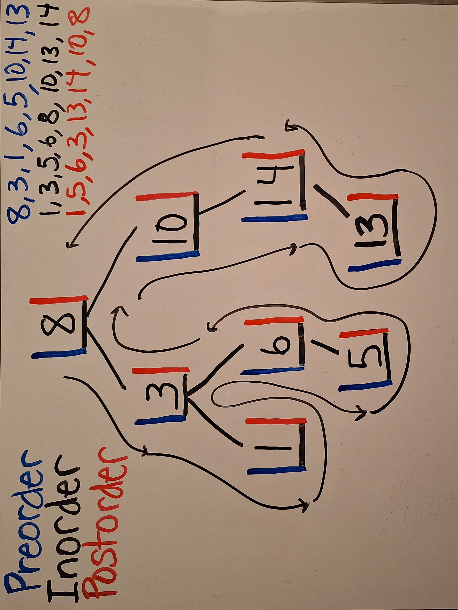

# Week 10 Lab

CSSSKL 143 - 03/8/24

## 🔑 Key Points 🔑

    1. Binary Search Tree: 3 traversal methods
    2. BST: Add a node
    3. Easy Leetcode Problems

## Review the code first

**TreeNode class** - Notice how its similar to the Node class for LinkedLists? Just with an extra data member.

* I have separated my code into a `TreeNode` class and a `Tree` class. Technically you don't need to do this but it is always best to separate components as much as possible.

🏆 This demonstrates some key best practices:

    1. Encapsulation: Hiding the TreeNode information from other classes. This helps with debugging.

    2. Separation of Concerns: Keep everything as private and separated as possible.

    3. Modularity: Break down your code into small pieces with a specific function

**Tree class** - This is where a Tree data member is defined (just a TreeNode for the root) and constructors are made.

🏆 Be sure to include a default constructor, and one that has all the parameters as arguments. Add more if needed.

## Three Traversal Methods - How to remember the difference?

### Visual version

* Imagine traveling around the tree in a counter-clockwise route. You will pass each node on the left side, bottom, or right side.

* If you note the nodes as you visit the left sides, this is **preorder** traversal

* If you record the bottoms first, this is **inorder** traversal

* If you track your path as you visit the right sides, that's **postorder** traversal

### Logical version

* Each subtree consists of a parent node, and a left and right child (if present).

✅ **Inorder** traversal goes

    * Left child
    * Parent node
    * Right child

🌟 The values will be accessed **in increasing order**

✅ **Preorder** traversal goes

    * Parent node
    * Left child
    * Right child

🌟 Parent node first, then child nodes

✅ **Postorder** traversal goes

    * Left child
    * Right child
    * Parent node

🌟 Child nodes first, then parent node

📝 The Left Child always comes before the Right Child when traversing

### Conceptual version

### Now let's Code it

* Use the following pseudocode
* Note that the helper methods are unnecessary, but it allows you to call the methods without passing in a node, AND it lets me keep the traversal algorithms `private` so other classes can't access them!
---
**Inorder** - [CLRS pg 288]

    INORDER-TRAVERSAL(x)
    1  if x != null
    2      INORDER-TRAVERSAL(x, left)
    3      print x.data
    4      INORDER-TRAVERSAL(x, right)
---
**Preorder**

    PREORDER-TRAVERSAL(x)
    1  if x != null
    2      print x.data
    3      PREORDER-TRAVERSAL(x, left)      
    4      PREORDER-TRAVERSAL(x, right)
---
**Postorder**

    POSTORDER-TRAVERSAL(x)
    1  if x != null
    2      POSTORDER-TRAVERSAL(x, left)
    3      POSTORDER-TRAVERSAL(x, right)      
    4      print x.data
---

## Adding a node to a BST

### Pseudocode

    ADD(data)
    1   root = ADD-NODE(node, data)

    ADD-NODE(node, data)
    1    if node == null
    2        return node
    3    if data < node.data
    4        node.left = (ADD-NODE(node, data))
    5    else
    6        node.right = (ADD-NODE(node, data))
    7    
    8    return node

* I'll let you figure out the other essential Tree methods 🙂

## Bonus: Easy Tree Leetcode Problems

* 94. Binary Tree Inorder Traversal
* 144. Binary Tree Preorder Traversal
* 145. Binary Tree Postorder Traversal
* 2236. Root Equals Sum of Children
* 112. Path Sum